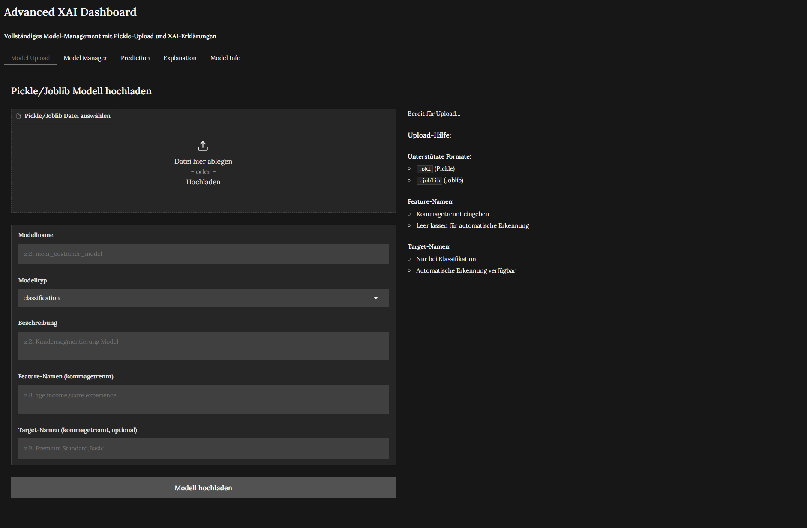
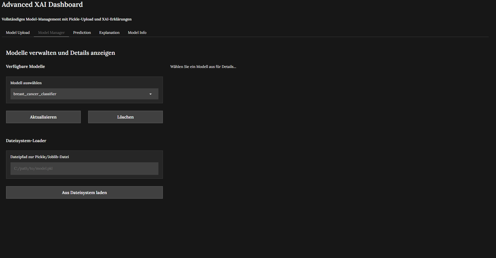
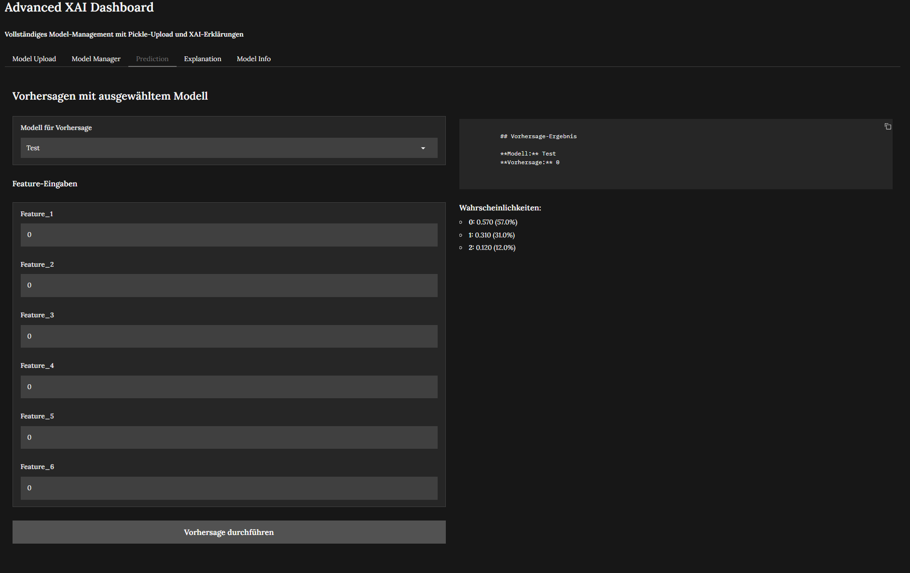
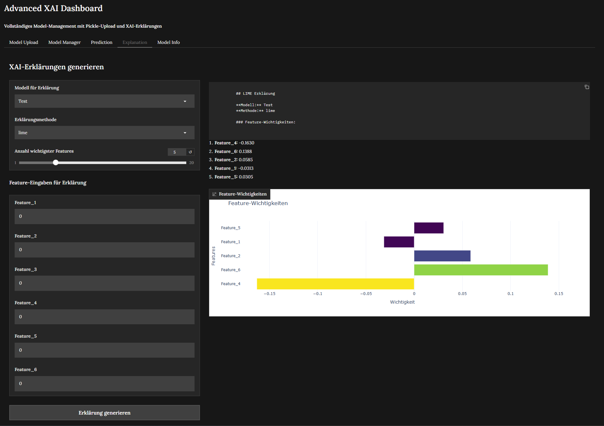
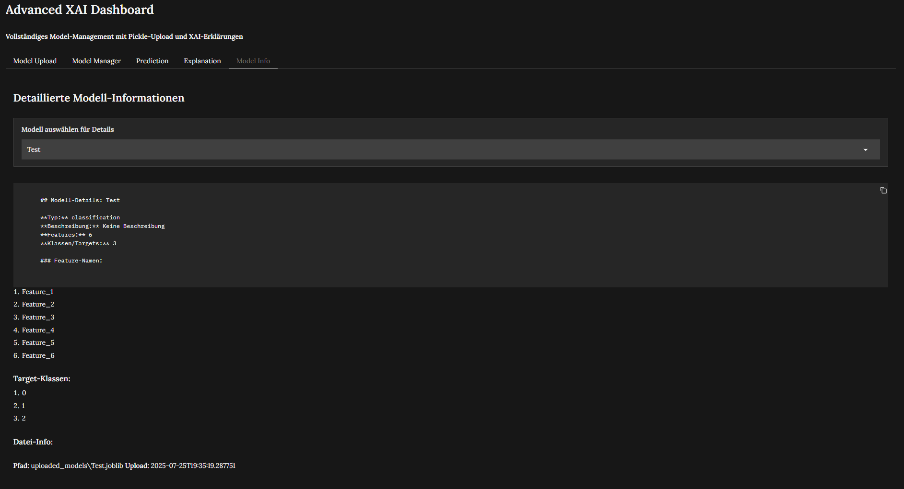

# Advanced XAI Dashboard

Ein vollständiges **Explainable AI Dashboard** mit Model-Management, Pickle-Upload und interaktiven XAI-Erklärungen.



## Features

### **Model Management**
- **Pickle/Joblib Upload**: Laden Sie Ihre trainierten ML-Modelle direkt hoch
- **Automatische Erkennung**: Feature-Namen und Target-Klassen werden automatisch erkannt
- **Dateisystem-Integration**: Modelle direkt aus dem Dateisystem laden
- **Persistente Speicherung**: Hochgeladene Modelle bleiben verfügbar



### **XAI-Erklärungen**
- **LIME**: Local Interpretable Model-agnostic Explanations
- **SHAP**: SHapley Additive exPlanations
- **Permutation Importance**: Feature-Wichtigkeiten durch Permutation
- **Interaktive Visualisierungen**: Plotly-Charts für Feature-Wichtigkeiten



### **Vorhersagen**
- **Echtzeit-Vorhersagen**: Sofortige Resultate für neue Datenpunkte
- **Wahrscheinlichkeiten**: Klassenwahrscheinlichkeiten bei Klassifikation
- **Dynamische Eingaben**: Feature-Eingabefelder passen sich automatisch an



### **Dashboard-Tabs**
1. **Model Upload**: Hochladen neuer Modelle
2. **Model Manager**: Verwalten und Details anzeigen
3. **Prediction**: Vorhersagen durchführen
4. **Explanation**: XAI-Erklärungen generieren
5. **Model Info**: Detaillierte Modell-Informationen



## Installation

### Voraussetzungen
- **Python 3.10+**
- **uv** Package Manager (empfohlen) oder pip

### Setup
```bash
# Repository klonen
git clone <repository-url>
cd XAI_Dash

# Abhängigkeiten installieren
uv sync
# oder mit pip:
# pip install -r requirements.txt
```

### Abhängigkeiten
- **gradio** 5.34.0 - Web-Interface
- **scikit-learn** - ML-Modelle
- **plotly** - Interaktive Visualisierungen
- **pandas** - Datenverarbeitung
- **numpy** - Numerische Berechnungen
- **lime** - LIME-Erklärungen
- **shap** 0.48.0 - SHAP-Erklärungen
- **joblib** - Modell-Serialisierung

## Schnellstart

### Dashboard starten
```bash
uv run python start_dashboard.py
```

Das Dashboard öffnet sich automatisch im Browser unter `http://127.0.0.1:7860`

### Eigenes Modell hochladen

1. **Model Upload Tab** öffnen
2. **Pickle/Joblib-Datei** auswählen (.pkl oder .joblib)
3. **Modellname** eingeben (z.B. "mein_kundenmodell")
4. **Modelltyp** wählen (classification oder regression)
5. **Feature-Namen** eingeben (kommagetrennt) oder automatisch erkennen lassen
6. **Target-Namen** eingeben (nur bei Klassifikation)
7. **"Modell hochladen"** klicken

### Vorhersagen durchführen

1. **Prediction Tab** öffnen
2. **Modell auswählen** aus der Dropdown-Liste
3. **Feature-Werte** eingeben
4. **"Vorhersage durchführen"** klicken

### XAI-Erklärungen generieren

1. **Explanation Tab** öffnen
2. **Modell auswählen**
3. **Erklärungsmethode** wählen (LIME, SHAP, Permutation)
4. **Feature-Werte** eingeben
5. **"Erklärung generieren"** klicken

## Projektstruktur

```
XAI_Dash/
├── app/
│   ├── __init__.py
│   ├── config.py                 # Konfiguration
│   ├── api/
│   │   ├── __init__.py
│   │   └── main.py              # FastAPI Backend
│   ├── explainers/
│   │   ├── __init__.py
│   │   └── model_agnostic.py    # LIME, SHAP, Permutation
│   ├── models/
│   │   ├── __init__.py
│   │   └── model_manager.py     # Model-Management
│   └── ui/
│       ├── __init__.py
│       └── advanced_dashboard.py # Dashboard UI
├── data/                        # Datenverzeichnis
├── images/                      # Screenshots
├── uploaded_models/             # Hochgeladene Modelle
├── start_dashboard.py           # HAUPTSTART-DATEI
├── pyproject.toml              # Abhängigkeiten
└── README.md
```

## Verwendung

### Unterstützte Modelltypen
- **Klassifikation**: Random Forest, SVM, Logistic Regression, etc.
- **Regression**: Random Forest, Linear Regression, etc.
- **Alle scikit-learn-kompatiblen Modelle**

### Dateiformate
- **.pkl** (Pickle)
- **.joblib** (Joblib)

### Automatische Erkennung
Das System erkennt automatisch:
- **Feature-Namen** (falls `feature_names_in_` verfügbar)
- **Anzahl Features** (über `n_features_in_`)
- **Klassenanzahl** (über `classes_` Attribut)
- **Modelltyp** (Klassifikation/Regression)

## Erweiterte Funktionen

### Model Manager
- **Modelle löschen**: Entfernen nicht mehr benötigter Modelle
- **Details anzeigen**: Vollständige Modell-Informationen
- **Metadaten**: Upload-Zeitstempel, Dateipfade, Beschreibungen

### XAI-Methoden

#### LIME (Local Interpretable Model-agnostic Explanations)
- Erklärt **individuelle Vorhersagen**
- Funktioniert mit **jedem Modell**
- Zeigt **lokale Feature-Wichtigkeiten**

#### SHAP (SHapley Additive exPlanations)
- **Spiel-theoretischer Ansatz**
- **Additive Feature-Beiträge**
- **Konsistente Erklärungen**

#### Permutation Importance
- **Modell-agnostisch**
- **Globale Feature-Wichtigkeiten**
- **Robuste Methode**

### Konfiguration

Die Anwendung kann über `app/config.py` konfiguriert werden:

```python
class Config:
    MODEL_DIR = "models"
    DATA_DIR = "data"
    UPLOAD_DIR = "uploaded_models"
```

## Beispiel-Workflow

```python
# 1. Dashboard starten
python start_dashboard.py

# 2. Modell vorbereiten (außerhalb Dashboard)
from sklearn.ensemble import RandomForestClassifier
import joblib

model = RandomForestClassifier()
# ... Training ...
joblib.dump(model, "mein_modell.joblib")

# 3. Im Dashboard:
# - Model Upload Tab
# - mein_modell.joblib hochladen
# - Prediction Tab verwenden
# - Explanation Tab für XAI
```

## Troubleshooting

### Häufige Probleme

**Problem**: Modell nicht in Dropdown sichtbar
**Lösung**: "Aktualisieren" Button im Model Manager Tab klicken

**Problem**: Feature-Namen nicht erkannt
**Lösung**: Manuell im Upload eingeben (kommagetrennt)

**Problem**: SHAP-Fehler bei bestimmten Modellen
**Lösung**: Alternative Erklärungsmethode (LIME/Permutation) verwenden

### Log-Ausgaben
Das System gibt detaillierte Logs aus:
```bash
Modell 'mein_modell' erfolgreich registriert
Model Manager geladen: 5 Modelle verfügbar
UPLOAD FUNKTIONIERT!
```

## Entwicklung

### Code-Struktur
- **UI**: Gradio-basierte Web-Oberfläche
- **Backend**: Model Manager für Modell-Verwaltung
- **XAI**: Modulare Explainer-Klassen
- **API**: FastAPI für erweiterte Funktionen

### Erweiterungen
Neue XAI-Methoden können einfach hinzugefügt werden:

```python
class NewExplainer:
    def explain(self, model, instance, **kwargs):
        # Ihre Implementierung
        return explanation_data
```

## Performance

- **Schnelle Uploads**: Direkte Dateikopie
- **Effiziente Vorhersagen**: In-Memory Modelle
- **Responsive UI**: Asynchrone Verarbeitung
- **Skalierbar**: Modulare Architektur

## Sicherheit

- **Lokale Ausführung**: Keine Daten verlassen das System
- **Sichere Uploads**: Nur .pkl/.joblib Dateien
- **Isolierte Modelle**: Jedes Modell läuft separat

## Lizenz

MIT License

Copyright (c) Frank Reis

Permission is hereby granted, free of charge, to any person obtaining a copy
of this software and associated documentation files (the "Software"), to deal
in the Software without restriction, including without limitation the rights
to use, copy, modify, merge, publish, distribute, sublicense, and/or sell
copies of the Software, and to permit persons to whom the Software is
furnished to do so, subject to the following conditions:

The above copyright notice and this permission notice shall be included in all
copies or substantial portions of the Software.

THE SOFTWARE IS PROVIDED "AS IS", WITHOUT WARRANTY OF ANY KIND, EXPRESS OR
IMPLIED, INCLUDING BUT NOT LIMITED TO THE WARRANTIES OF MERCHANTABILITY,
FITNESS FOR A PARTICULAR PURPOSE AND NONINFRINGEMENT. IN NO EVENT SHALL THE
AUTHORS OR COPYRIGHT HOLDERS BE LIABLE FOR ANY CLAIM, DAMAGES OR OTHER
LIABILITY, WHETHER IN AN ACTION OF CONTRACT, TORT OR OTHERWISE, ARISING FROM,
OUT OF OR IN CONNECTION WITH THE SOFTWARE OR THE USE OR OTHER DEALINGS IN THE
SOFTWARE.

## Danksagungen

- **Gradio** für das exzellente Web-UI Framework
- **LIME** und **SHAP** Teams für die XAI-Bibliotheken
- **scikit-learn** Community für das ML-Ökosystem
- **Plotly** für interaktive Visualisierungen

---

**Entwickelt für Benutzerfreundlichkeit und Flexibilität im Bereich Explainable AI.**
